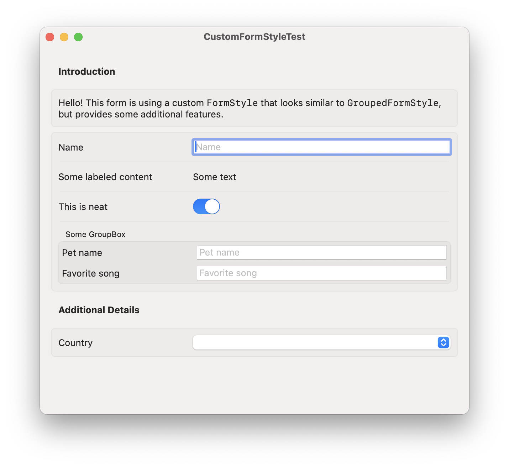

# CustomFormStyle

SwiftUI's `Form` can be styled with the modifier `.formStyle()`. macOS 15 brought official support for [SwiftUI container iteration](https://developer.apple.com/videos/play/wwdc2024/10146/), making the construction of a custom [`FormStyle`](https://developer.apple.com/documentation/swiftui/formstyle) finally possible [^1].

This sample creates a basic form style that's similar to the integrated [`GroupedFormStyle`](https://developer.apple.com/documentation/swiftui/groupedformstyle) but more optimized for forms with many fields and more complex controls.

This sample only supports macOS, but adapting it for iOS would be easy.

**Compared to `GroupedFormStyle`:**

- Uses full width for content
- Label column is limited in width
- Field column is left-aligned
- Text fields have default style (not borderless)
- Ability to specify if all fields should be indented (regardless if they have a label)

**Notable issues, related to the extraction of labels from instances of `TextField`:**

- Using private APIs and `Mirror`, so probably not accepted into the App Store
- Concurrency workarounds to use `TextFieldStyle` on MainActor
- The title label will remain visible inside the text field (in addition to the label column)

Hopefully, macOS 16 or 17 will properly support a custom TextFieldStyle. 

[^1]: If you need a custom `FormStyle` in macOS 14, you can use `_VariadicView_MultiViewRoot` instead of container iteration. More about that [here](https://movingparts.io/variadic-views-in-swiftui).